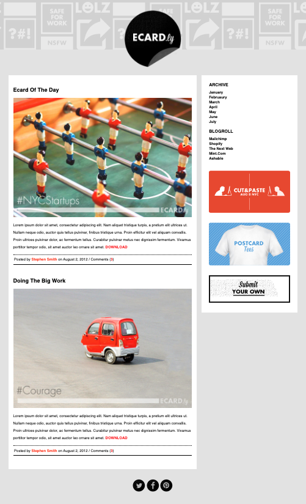

# Practice What You Learned - E-Cardly Recreation

## Instructions
### Getting Started
Fork this CodeSandbox: [Card Website Mockup](https://codesandbox.io/s/immutable-waterfall-refjo3)

### Deliverables
index.html and styles.css files that try to recreate the eCardly mockup as best as you can. The images you'll need are in the imagesdirectory inside this eCardly folder.

## Outcome
